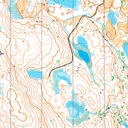

# OCAD to GeoJSON




JavaScript library and command line tool for exporting [OCAD](https://www.ocad.com/) map files to open formats:

- [GeoJSON](http://geojson.org/)
- SVG
- PDF
- [Mapbox Style Spec](https://www.mapbox.com/mapbox-gl-js/style-spec/)
- [QGIS](https://qgis.org/en/site/) / QML (very rough and incomplete)

You can use this to get geo/GIS data out of an OCAD file. OCAD version 10, 11 and 12 and 2018 files are mostly supported.

## See it in action

* [O-scout](https://o-scout.vercel.app/) - Online app for viewing OCAD maps, course settings and exporting to PDF or SVG
* [ocad2tiles](https://github.com/perliedman/ocad2tiles/) - command line tool for generating tiled maps or creating images (PNG, JPEG, SVG) from OCAD maps
* ...or just install `npm install ocad2geojson` and use the library in your own project!

## Usage

### Command line

Installing the `ocad2geojson` package will also install the binary `ocad-tool` in
your path.

It can be used to get data out of an OCAD file in various formats:

```
Usage: ocad-tool [options] [command]

Options:
  -h, --help                       display help for command

Commands:
  info [options] <path>            display file info
  export [options] <path> <outpu>  export OCAD map into another format
  help [command]                   display help for command
```

Use `info` to extract information from OCAD files:

```
Usage: ocad-tool info [options] <path>

display file info

Options:
  --symbols                   dump symbol information
  --filter-symbols <numbers>  only show numbered symbols
  --icons-bits                display symbols' iconBits property (hidden by default)
  -h, --help                  display help for command
```

Use `export` to export OCAD files to other formats:

```
Usage: ocad-tool export [options] <path> <outpu>

export OCAD map into another format

Options:
  -f, --format <string>  output format (geojson, svg, qml, mvt), otherwise guessed from output file extension
  --export-hidden        include hidden objects in the export (default: false)
  -h, --help             display help for command
```

### API

Exported functions:

- `readOcad` - read and parse OCAD maps
- `ocadToGeoJson` - transform objects from a parsed OCAD file into GeoJSON
- `ocadToSvg` - transform a parsed OCAD map into an SVG document
- `ocadToMapboxGlStyle` - transform symbol styles of a parsed OCAD file into Mapbox GL style spec
- `ocadToQml` - transform a parsed OCAD file into QML

Begin by parsing an OCAD file with `readOcad`: this function accepts a file path
as string, or a [Buffer](https://nodejs.org/api/buffer.html) instance to read from.
`readOcad` returns a [Promise](https://developer.mozilla.org/en-US/docs/Web/JavaScript/Reference/Global_Objects/Promise) that will resolve to the parsed result.

Example, turning an OCAD file into GeoJSON and Mapbox GL styles:

```js
const { readOcad, ocadToGeoJson, ocadToMapboxGlStyle } = require('../')

readOcad(filePath).then(ocadFile => {
  const geojson = ocadToGeoJson(ocadFile)
  console.log(JSON.stringify(geojson))
  const layerStyles = ocadToMapboxGlStyle(ocadFile)
  console.log(JSON.stringify(layerStyles))
})
```

I will try to write some docs, in the meantime, check out the [demo directory](demo) for some examples of how to use this module.

## Missing features

Some OCAD features are currently not fully supported:

- Hatch fills are not supported when exported to Mapbox styles and emulated by semi-transparent fills
- Fill patterns are ~~not supported~~ supported for SVG and PDF exports
- ~~Curves are not supported~~ Bezier curves now supported!
- ~~Some texts are not exported~~
- ~~SVG / PDF currently lack any text~~ SVG and PDF now have text support
- ...and probably a lot more that I do not even know is missing

Feel free to open issues for lacking features - I will not promise to add them, but good to keep track of what is missing.

Have you built something with this module, or want to help out improving it? I'd love to know; open an issue, pull request or contact [per@liedman.net](mailto:per@liedman.net).

## License

Since I highly dislike the closed source nature of some of the software used in orienteering (well, mostly OCAD),
this software is licensed under [AGPL-3.0](LICENSE); in short, to use this software, you must distribute source.
